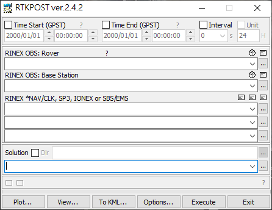

# Getting Started
## GNSS 
Data preparation
- Download the RINEX observation &lt;Date&gt;\.&lt;scenario&gt;\.&lt;place&gt;\.&lt;receiver&gt;\.obs
- Download the Ephemeris data, e.g. [SatRef](https://www.geodetic.gov.hk/en/rinex/downv.aspx) from Hong Kong Lands Department 


Using GNSS library for post-processing and evaluation
- Opensource GNSS evaluation tools: GUI, C++: [RTKLIB](http://www.rtklib.com/), MATLAB: [goGPS](https://github.com/goGPS-Project/goGPS_MATLAB)




## Visual Inertial Odometry 
Data preparation,
- Download the bag file;
- Clone the [VINS-Fusion](https://github.com/HKUST-Aerial-Robotics/VINS-Fusion) repository from GitHub;
- Update camera intrinsics and extrinsics in the yaml file;
- Run the framework of VINS-Fusion:
```
roslaunch vins vins_rviz.launch
rosrun vins vins_node ~/catkin_ws/src/VINS-Fusion/config/vi_car/vi_car.yaml
rosbag play DATASET.bag
```

## LiDAR Inertial Odometry
- Take scenario (a) as an example
Download the rosbag [UrbanNav-HK-Medium-Urban-1](https://www.dropbox.com/s/mit5v1yo8pzh9xq/UrbanNav-HK_TST-20210517_sensors.bag?dl=0)
- Prepared the [fine-tune LIO-SAM](https://www.dropbox.com/s/g514ra8zm6nfz9r/LIO-SAM_for_urban.zip?dl=0) based on the intrinsic and extrinsic. The origianl LIO-SAM can be found at [LIO-SAM](https://github.com/TixiaoShan/LIO-SAM)
```
roslaunch lio_sam run_velodyne.launch
```
- Replay the Rosbag
```
rosbag play UrbanNav-HK_TST-20210517_sensors.bag
```

